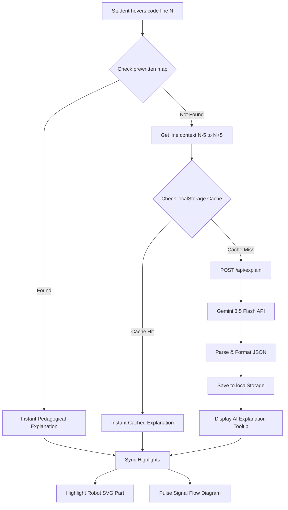

# Ronnie Learn IDE 🤖💻

**Ronnie Learn IDE** is a premium, interactive, web-based educational IDE designed to introduce beginners to embedded systems, robotics, and AI. By interfacing with the code of **Ronnie**, an ESP32-powered quadruped robot, students learn the fundamentals of physical computing in a visual, hands-on environment.

The application blends a professional-grade VS Code-style editor with synchronized SVG hardware representations, motion previews, signal flow paths, and a dedicated AI assistant tutor.

---

## 🌟 Key Features

*   **VS Code-Style Editor (Monaco)**: Features real Arduino/C++ source code with full syntax highlighting.
*   **Hybrid Explanation Engine**: 
    *   **Prewritten Map**: Instantly displays hand-crafted, pedagogical explanations for core code lines on hover (e.g., servo control, I2C setup, WiFi configurations).
    *   **Gemini 3.5 Flash Fallback**: Any custom code or unmapped lines trigger a live, contextual AI analysis to explain what the line does, its advanced details, and related hardware.
    *   **Smart Caching**: AI-generated explanations are hashed and stored in `localStorage` for instant secondary hover lookups.
*   **Synchronized Visualizations**:
    *   **Robot Diagram**: Interactive SVG showing a top-down and side view of Ronnie. Hovering code lines (such as a leg servo control) dynamically highlights the affected physical leg on the model.
    *   **Motion Preview**: Shows an active walking gait (trot/walk cycle) with physical servo gauges mapping angle movements in real-time.
    *   **Signal Flow Diagram**: Explains the data path: `ESP32 Brain` ➔ `I2C Bus` ➔ `PCA9685 Driver` ➔ `Servo Motor`. Lines light up dynamically based on the active code segment.
    *   **Hardware Architecture Diagram**: An overview of the microchip layout (pins, communication protocol, power supplies).
*   **Interactive AI Tutor**: A side panel chat interface powered by **Gemini 3.5 Flash**, loaded with suggested beginner questions, explaining code logic, current control schemes, and electrical constraints.

---

## 🏗️ Architecture & Data Flow



---

## 📁 File Structure

```
keen-pasteur/
├── app/
│   ├── layout.tsx           # Main page structure (Inter + JetBrains Mono)
│   ├── page.tsx             # Workspace entry point, 5-tab layout & status bar
│   ├── globals.css          # Tailwind CSS v4 directives + custom glass tokens
│   └── api/
│       └── explain/
│           └── route.ts     # Gemini 3.5 Flash explanation API endpoint
├── components/
│   ├── Editor/
│   │   ├── CodeEditor.tsx   # Monaco editor wrapper with custom hover handling
│   │   └── HoverTooltip.tsx # Floating glassmorphism tooltip (beginner/advanced toggle)
│   ├── Panels/
│   │   ├── AIAssistant.tsx  # Interactive chat panel with Gemini tutor
│   │   ├── HardwareDiagram.tsx # Integrated SVG schema of pins & microchips
│   │   └── SignalFlowDiagram.tsx # Dynamic visualizer for ESP32 ➔ I2C ➔ PCA9685 ➔ Servo
│   └── Robot/
│       ├── MotionPreview.tsx # Leg movements gait cycle simulation + gauges
│       └── RobotDiagram.tsx # SVG quadruped diagram with highlight sync
├── data/
│   ├── ronnieCode.ts        # The actual quadruped robot Arduino/C++ source code
│   └── explanations.ts      # Full mapping of 285+ line-by-line static pedagogical explanations
├── hooks/
│   ├── useExplanation.ts    # Hybrid hook orchestrating static vs AI explanations
│   └── useRobotHighlight.ts # Hook linking code lines to robot parts (legs, chips, etc.)
├── lib/
│   └── aiExplainer.ts       # Hash functions, local caching, and API request handles
├── package.json             # Workspace dependencies and scripts
└── tsconfig.json            # TypeScript configuration compiler options
```

---

## ⚙️ Tech Stack & Dependencies

*   **Framework**: Next.js 16 (App Router)
*   **Rendering**: React 19 (Client & Server Components)
*   **Styling**: Tailwind CSS v4 (configured via custom layer tokens in `globals.css`)
*   **AI Engine**: `@google/generative-ai` (using the `gemini-3.5-flash` model)
*   **Code Editor**: `@monaco-editor/react` (Monaco Editor v4.7)
*   **Animations**: `framer-motion` (v12)
*   **Icons**: `lucide-react`

---

## 🚀 Getting Started

### 1. Prerequisites
Make sure you have Node.js installed (v18.x or later is recommended).

### 2. Installation
Clone the repository and install dependencies:
```bash
git clone <repository-url>
cd keen-pasteur
npm install
```

### 3. Environment Variables
Create a `.env.local` file in the root directory and add your Gemini API key:
```env
GEMINI_API_KEY=your_gemini_api_key_here
```

### 4. Running the Dev Server
Launch the local development server:
```bash
npm run dev
```
Open [http://localhost:3000](http://localhost:3000) in your web browser.

### 5. Build for Production
To build the application for deployment:
```bash
npm run build
npm run start
```

---

## 📝 Customizing Ronnie's Code & Explanations

### Changing the Code
The source code shown inside the Monaco Editor is defined in `data/ronnieCode.ts`. You can modify this string to showcase new gait patterns, sensor readings, or custom robotics features.

### Adding Hand-Crafted Explanations
Static explanations are configured in `data/explanations.ts`. To link a new line of code to a static explanation:
1. Locate the line number of your target line in `data/ronnieCode.ts`.
2. Add an entry to the `explanations` map:
   ```typescript
   LINE_NUMBER: {
     title: "Descriptive Title",
     beginnerExplanation: "Simple explanation for students.",
     advancedExplanation: "Technical details (registers, protocols, etc.).",
     relatedHardware: ["ESP32", "PCA9685"],
     tags: ["WiFi", "I2C"],
     robotPart: "front-left" // Highlights this specific part of the robot SVG
   }
   ```

---

## 🔍 Verification & Testing

Verify correctness and clean code using these built-in checks:
*   **Build Verification**: Runs full TypeScript check and compiles the pages.
    ```bash
    npm run build
    ```
*   **Linting**:
    ```bash
    npm run lint
    ```
